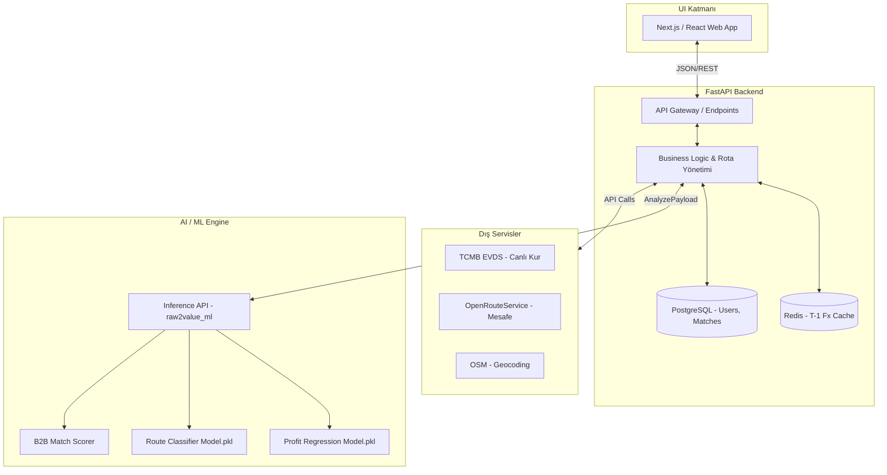

<div align="center">
  <h1>🏔️ Raw2Value AI</h1>
  <p><b>Kapadokya'nın hammaddesini, küresel katma değere bağlayan zekâ katmanı.</b></p>
  
  [](https://www.python.org/downloads/release/python-3110/)
  [](https://fastapi.tiangolo.com/)
  [](https://xgboost.readthedocs.io/)
  []()
  [](https://opensource.org/licenses/MIT)
</div>

---

## 📖 Proje Nedir? (What)

**Raw2Value AI**, TR71 (Kapadokya) bölgesindeki yerel üreticilerin hammadde (Pomza, Perlit, Kabak Çekirdeği) satış ve işleme süreçlerini optimize eden, makine öğrenmesi tabanlı bir **Karar Destek Motorudur (Decision Support Engine)**. 

Geleneksel B2B pazar yerlerinden farklı olarak, alıcı ve satıcıyı rastgele listelemez. Sisteme girilen *hammadde, tonaj, kalite ve hedef pazar* verilerini işleyerek; en yüksek katma değeri yaratacak **işleme rotasını**, net **kâr tahminini (TRY)**, resmi **CO₂ ayak izini** hesaplar ve tedarik zincirindeki en uygun aktörleri (İşleyici/Alıcı) skorlayarak eşleştirir.

## 🎯 Neden Raw2Value? (Why)

### Devasa Potansiyel, Devasa Kayıp
Türkiye, dünya pomza üretiminin **%45,6'sına** sahip olarak açık ara dünya lideridir. Ancak bu devasa potansiyeli, tonunu ortalama **91,7 Dolara** "ham kaya" olarak ihraç ederek israf etmektedir. Oysa aynı hammadde mikronize edilerek işlendiğinde ton başına değeri **200-300 Dolar** bandına çıkmaktadır.

### Bilgi Asimetrisini Kırmak
Yerel üreticiler ve madenciler, ürünlerini işleyerek satmanın daha kârlı olduğunu bilirler. Ancak:
- Döviz kurlarındaki (EUR/USD) anlık dalgalanmalar,
- Avrupa Birliği Sınırda Karbon Düzenleme Mekanizması (CBAM) kaynaklı karbon vergileri,
- Gerçek navlun (lojistik) maliyetleri,
- Ve kendilerine en uygun yerel işleme tesisini (Processor) bulma zorluğu...

gibi riskleri hesaplayamadıkları için kararlarını **veriyle değil, sezgiyle** verirler. Raw2Value AI, bu "Bilgi Asimetrisini" ortadan kaldırarak; üreticiye şeffaflık, işleyici fabrikalara tam kapasite çalışma fırsatı, Avrupalı alıcılara ise yeşil ve izlenebilir bir tedarik zinciri sunar.

## ⚙️ Nasıl Çalışır? (How)

Sistem **"Yetenek Bazlı" (Capability-Based)** bir aktör modeline dayanır. Hammadde üreticisi sisteme girdiği andan itibaren süreç şu şekilde işler:

1. **Veri Toplama:** Üretici arayüze (Basic/Advanced Mode) malın cinsini ve miktarını girer.
2. **Canlı Zenginleştirme:** Sistem arka planda TCMB'den anlık döviz kurlarını ve OpenRouteService'den gerçek karayolu mesafelerini çeker.
3. **ML Karar Motoru:** Eğitilmiş CatBoost/XGBoost modelleri (Classification & Regression) çalışır.
4. **Çıktı (Deliverables):**
   - Hangi formda satılmalı? *(Örn: Ham satma, Mikronize et)*
   - Ne kadar kâr edilecek? *(TL bazında net öngörü)*
   - Karbon maliyeti nedir? *(Ton-km bazlı tCO2 hesaplaması)*
   - Malı kim işleyecek ve kime satılacak? *(Weighted Match Scoring ile B2B eşleşme)*

---

## 🏗️ Sistem Mimarisi (Architecture)

Raw2Value, yüksek erişilebilirlik ve düşük gecikme süreleri (<500ms) hedefleyerek modern bir mikroservis yapısında kurgulanmıştır.


---

## 🚀 Hızlı Başlangıç (Quick Start)

### 1. ML Engine (Inference) Paketinin Kullanımı

Geliştirdiğimiz makine öğrenmesi paketini projeye dahil etmek oldukça basittir:
```python
from raw2value_ml import analyze, AnalyzePayload, LiveFx

# Veri yükünü (Payload) hazırlayın
payload = AnalyzePayload(
    raw_material="pomza",
    tonnage=150,
    quality="A",
    origin_city="Nevşehir",
    target_country="DE",
    target_city="Hamburg",
    transport_mode="kara",
    priority="max_profit",
    input_mode="basic",
    live_fx=LiveFx(usd_try=45.05, eur_try=52.67, last_updated="2026-05-02"),
)

# Tahminleri (Inference) alın
response = analyze(payload)

print(f"Önerilen Rota: {response.recommended_route}")
print(f"Beklenen Kâr: ₺{response.expected_profit_try:,.2f}")
print(f"CO2 Ayak İzi: {response.co2_kg} kg")

print("\nGerekçeler:")
for reason in response.reason_codes:
    print("-", reason.text)
```

---

## 🛠️ Kurulum & Dağıtım (Installation & Deployment)

Proje hem lokal geliştirme hem de Docker üzerinden containerize edilmiş şekilde çalıştırılabilir. Backend ile model inference (`analyze(payload) → AnalyzeResponse`) arasındaki sözleşme sabittir. Detaylar için: `docs/master_model_egitim_raporu.md` §11.3.

### Tek Komutla Tüm Stack (Docker)
PostgreSQL, Redis, ML modelleri ve FastAPI sunucusunu ayağa kaldırmak için:
```bash
cp backend/.env.example backend/.env
docker compose up -d --build
docker compose exec api alembic upgrade head
docker compose exec api python scripts/seed_demo.py
```
*API Dokümantasyonu (Swagger) artık `http://localhost:8000/docs` adresinde yayındadır.*

### Lokal Geliştirme (Docker'sız)
Eğer veritabanlarınız halihazırda sisteminizde çalışıyorsa (Postgres/Redis env ayarları yapılmışsa):
```bash
# ML Paketi Kurulumu
pip install -e .                                          

# Backend Bağımlılıkları
pip install -r backend/requirements.txt -r backend/requirements-dev.txt

# Uvicorn ile Server'ı Başlatma
cd backend && uvicorn app.main:app --reload
```

---

## 🧠 ML Eğitim Pipeline'ı (Sıfırdan Eğitim)

Sentetik verilerin üretilmesi, artırılması (augmentation) ve modellerin (XGBoost/CatBoost) eğitilmesi için pipeline otomatize edilmiştir.

**Tüm süreci başlatmak için:**
```bash
# Linux/Mac
bash scripts/run_full_pipeline.sh

# Windows
pwsh scripts/run_full_pipeline.ps1
```

*(Dilerseniz `ml/notebooks/` dizinindeki Jupyter Notebook'ları 01'den 06'ya kadar sırayla çalıştırarak süreci adım adım izleyebilirsiniz.)*

---

## 🧪 Test ve Performans Kriterleri

Sistemin stabilitesi 80+ birim ve entegrasyon testi ile korunmaktadır. Tüm testler yeşil (passing) olmalıdır.
```bash
# ML Testleri
pytest ml/tests/ -v

# Backend QA Smoke (G4 Gate - 7/7 OK olmalı)
bash backend/scripts/qa_smoke.sh

# Backend Testleri
cd backend && pytest tests/ -v
```

**Performans Hedeflerimiz:**
| Operasyon | Maksimum Gecikme Hedefi |
|---|---|
| `analyze()` cold start | < 2.0s |
| `analyze()` warm state | < 500ms |
| `match_buyers()` (top_k=5) | < 50ms |

---

## 🔧 Sorun Giderme (Troubleshooting)

- **Port Çakışması (5432 / 6379):** Host makinede Postgres veya Redis açıksa Docker "bind: address already in use" hatası verir. Dev override kullanarak host portlarını kaydırın:
  ```bash
  docker compose -f docker-compose.yml -f docker-compose.dev.yml up -d --build
  
```
  *(Host'tan DB: localhost:5433, Redis: localhost:6380 olur. Container içi değişmez).*
- **TCMB API Key Hatası:** `backend/.env` dosyasında `JWT_SECRET` ve `TCMB_EVDS_API_KEY` placeholder kalsa da lokal dev için yeterlidir. Anahtar yoksa sistem `/api/fx/current` fallback değerlerine (USD=45, EUR=52) düşerek çalışır.
- **Warmup Gecikmesi:** Docker `up` komutundan sonra ML modellerinin belleğe yüklenmesi (~20-30 saniye) sürebilir. Bu sürede `/health` servisi 503 döner. `docker compose logs api -f` ile `ml_warmup_complete` mesajını arayın.
- **Docker İmajı Modelleri Görmüyor:** `.dockerignore` dosyasında `*.pkl` satırı varsa kaldırılmalıdır. Build context proje kök dizini olmalıdır (`docker-compose.yml` -> `context: .`).

> Daha detaylı backend kurulum ve geliştirme rehberi için lütfen `docs/MASTER_BACKEND_GELISTIRME_RAPORU_PART1.md` ve `PART2.md` dosyalarını inceleyin.

---

> **Takım Feza** tarafından *Kapadokya Hackathon 2026* için sevgiyle ve kodla üretilmiştir. 🎈
